# Stock Review - 股票复盘分析系统

> 个人每日复盘炒股系统，帮助你在收盘后系统化完成"看大盘 -> 看板块 -> 看自选 -> 看新闻 -> 做决策"的完整复盘流程。

## 项目愿景

面向个人投资者的每日复盘工具，通过自动化数据采集、量化评级、AI 分析和情绪周期判断，降低复盘门槛，提升决策质量。

---

## 架构总览

```
stock-review/
├── backend/                 # Python FastAPI 后端
│   ├── main.py             # 应用入口 (lifespan + routes)
│   ├── app/
│   │   ├── api/v1/         # REST API 路由层
│   │   ├── core/           # 业务逻辑引擎
│   │   ├── data_provider/  # 多源数据获取层
│   │   ├── llm/            # LLM 统一调用层
│   │   ├── models/         # SQLAlchemy ORM 模型
│   │   ├── news/           # 新闻采集聚合
│   │   ├── schemas/        # Pydantic 请求/响应模型
│   │   ├── services/       # 定时任务 & 种子数据
│   │   ├── config.py       # 配置管理
│   │   ├── database.py     # 数据库连接
│   │   └── cache.py        # Redis 缓存
│   └── requirements.txt
├── frontend/                # React 前端
│   ├── src/
│   │   ├── api/            # Axios 客户端
│   │   ├── components/     # 通用组件
│   │   ├── pages/          # 页面组件
│   │   ├── stores/         # Zustand 状态管理
│   │   ├── utils/          # 工具函数
│   │   ├── App.tsx         # 路由配置
│   │   └── main.tsx        # 入口
│   ├── package.json
│   └── vite.config.ts
└── docker/                  # Docker 部署配置
    ├── docker-compose.yml
    └── nginx.conf
```

---

## 模块结构图

```mermaid
graph TD
    A["Stock Review (根)"] --> B["backend"]
    A --> C["frontend"]
    A --> D["docker"]

    B --> B1["api/v1"]
    B --> B2["core"]
    B --> B3["data_provider"]
    B --> B4["llm"]
    B --> B5["models"]
    B --> B6["news"]
    B --> B7["schemas"]
    B --> B8["services"]

    C --> C1["api"]
    C --> C2["components"]
    C --> C3["pages"]
    C --> C4["stores"]

    B1 --> B1a["market.py"]
    B1 --> B1b["review.py"]
    B1 --> B1c["ratings.py"]
    B1 --> B1d["watchlist.py"]
    B1 --> B1e["news.py"]
    B1 --> B1f["strategy.py"]
    B1 --> B1g["operations.py"]

    B2 --> B2a["rating_engine.py"]
    B2 --> B2b["sentiment_engine.py"]
    B2 --> B2c["review_engine.py"]
    B2 --> B2d["strategy_matcher.py"]
    B2 --> B2e["limit_up_tracker.py"]

    B4 --> B4a["client.py"]
    B4 --> B4b["multi_model.py"]
    B4 --> B4c["prompts/"]

    click B "./backend/CLAUDE.md" "查看后端模块文档"
    click C "./frontend/CLAUDE.md" "查看前端模块文档"
```



---

## 模块索引

| 模块路径 | 语言 | 职责描述 |
|---------|------|---------|
| `backend/` | Python | FastAPI 后端服务，提供 REST API、定时任务、数据采集 |
| `frontend/` | TypeScript | React SPA 前端，提供市场总览、评级、复盘等页面 |
| `docker/` | YAML | Docker Compose 部署配置 (Backend + Redis + Nginx) |

### 后端子模块

| 子模块 | 职责 |
|-------|------|
| `api/v1/` | REST API 路由：market、ratings、watchlist、news、review、strategy、operations |
| `core/` | 业务引擎：量化评级、情绪周期判断、复盘生成、战法匹配 |
| `data_provider/` | 多源数据获取：AKShare (主) + Tushare (辅) + efinance (兜底) |
| `llm/` | LLM 统一调用：LiteLLM 封装、多模型融合评级 |
| `models/` | SQLAlchemy ORM：Stock、Rating、DailyReview、SentimentCycleLog 等 |
| `news/` | 新闻采集聚合：财联社、东方财富、新浪三路采集去重 |
| `schemas/` | Pydantic 模型：请求参数校验、响应序列化 |
| `services/` | 定时任务调度 (APScheduler)、种子数据初始化 |

### 前端子模块

| 子模块 | 职责 |
|-------|------|
| `api/` | Axios HTTP 客户端，带 JWT 认证拦截器 |
| `components/` | 通用组件：Shell 布局、Sidebar 导航、图表组件 |
| `pages/` | 页面组件：Dashboard、RatingBoard、DailyReview、Watchlist 等 |
| `stores/` | Zustand 全局状态管理 |

---

## 运行与开发

### 环境要求

- Python 3.11+
- Node.js 18+
- Redis (可选，用于缓存)
- Docker (生产部署)

### 开发模式

```bash
# 后端
cd backend
pip install -r requirements.txt
python main.py  # 默认 http://localhost:8000

# 前端
cd frontend
npm install
npm run dev  # 默认 http://localhost:5173
```

### Docker 部署

```bash
cd docker
docker-compose up -d
# API: http://localhost:8000
# 前端: http://localhost (需先构建)
```

### 环境变量

复制 `.env.example` 为 `.env`，配置以下关键变量：

```env
# 数据源
TUSHARE_TOKEN=your_token
DATA_PROVIDER_PRIORITY=akshare,tushare,efinance

# LLM API Keys
DEEPSEEK_API_KEY=sk-xxx
ZHIPUAI_API_KEY=xxx
MOONSHOT_API_KEY=xxx

# 数据库
DATABASE_URL=sqlite+aiosqlite:///./data/stock_review.db

# 定时任务
REFRESH_HOUR=15
REFRESH_MINUTE=30
```

---

## 测试策略

**当前状态**: 无测试文件。

**建议补充**:
- `backend/tests/` - pytest 单元测试
  - `test_rating_engine.py` - 量化评级计算逻辑
  - `test_sentiment_engine.py` - 情绪周期判断
  - `test_api/` - API 端点集成测试
- `frontend/src/__tests__/` - Vitest 组件测试

---

## 编码规范

### 后端 (Python)

- 使用 FastAPI 依赖注入管理数据库会话 (`Depends(get_db)`)
- 异步优先：所有 IO 操作使用 `async/await`
- 日志规范：`logging.getLogger(__name__)`，INFO 级别记录关键操作
- 类型注解：函数参数和返回值必须标注类型

### 前端 (TypeScript)

- 组件使用函数式组件 + Hooks
- 状态管理优先使用 `useState`，全局状态使用 Zustand
- 样式使用 Tailwind CSS 原子类
- API 调用统一通过 `api/client.ts`

---

## AI 使用指引

### 适合 AI 辅助的任务

1. **新增 API 端点** - 参考现有 `api/v1/*.py` 模式
2. **扩展评级因子** - 在 `core/rating_engine.py` 添加新计算函数
3. **优化 LLM Prompt** - 修改 `llm/prompts/*.py`
4. **前端页面开发** - 参考 `pages/Dashboard.tsx` 模式

### 代码导航提示

- 量化评级核心算法: `backend/app/core/rating_engine.py`
- 情绪周期判断: `backend/app/core/sentiment_engine.py`
- 每日复盘生成: `backend/app/core/review_engine.py`
- 涨停梯队追踪: `backend/app/core/limit_up_tracker.py`
- 多源数据获取: `backend/app/data_provider/manager.py`
- 新闻采集聚合: `backend/app/news/aggregator.py`
- 定时任务调度: `backend/app/services/scheduler.py`

### 注意事项

- 数据源 (AKShare/Tushare) 有调用频率限制，测试时注意节流
- LLM 调用有成本，批量测试时建议 mock
- Redis 缓存失败时会降级为无缓存模式

---

## 变更记录 (Changelog)

### 2026-03-31 - 初始化架构师扫描

- 完成全仓清点：后端 74 个 Python 文件，前端 27 个 TS/TSX 文件
- 识别核心模块：评级引擎、情绪周期、复盘系统、新闻聚合
- 生成根级 CLAUDE.md 和模块级文档
- 覆盖率报告：已扫描核心业务代码，缺少测试文件
